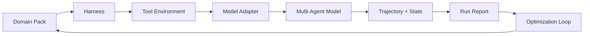

# Domain AI Forge

**The model + harness + multi-agent optimization framework for vertical AI.**

[中文 README](README.zh-CN.md)

Domain AI Forge helps teams turn a promising LLM demo into a measurable domain AI system. It treats every vertical AI product as a loop:



中文定位：这是一个面向垂域 AI 实践的整体优化框架，把 **model / harness / multi-agent model** 放在同一个可运行闭环里。目标不是再做一个聊天机器人壳子，而是让每个垂域 AI 项目都能被评测、复盘、迭代和开源复用。

## Why This Exists

Most domain AI projects fail in the same way:

- The model looks good in demos but has no domain regression harness.
- Agent workflows are built as prompts, not as testable systems.
- Domain knowledge, failure cases, and evaluation criteria live in scattered docs.
- Teams cannot compare model changes, prompt changes, retrieval changes, and agent changes with one scorecard.

Domain AI Forge starts from a simple claim:

> In vertical AI, the harness is the product memory, and agents are only useful when they can be measured.

## Quick Start

```bash
cd domain-ai-forge
python3 examples/customer_support/run_demo.py
```

Expected output:

```text
Domain AI Forge demo
overall_score: 0.96
pass_rate: 1.00
best_candidate: multi_agent_support_v1
```

Run tests:

```bash
python3 -m unittest discover -s tests
```

Install locally:

```bash
python3 -m pip install -e .
domain-ai-forge demo
```

## Core Concepts

**1. Model**

A model is anything that can answer a domain task: an LLM API, a local model, a rules engine, a retrieval pipeline, or an agent team.

**2. Harness**

A harness is the domain testbed. It contains cases, expected behaviors, rubrics, forbidden patterns, risk checks, trajectory scorers, state checks, and score aggregation.

**3. Tool Environment**

A tool environment is a deterministic simulator for domain tools and business state. It lets the harness verify what the system did, not only what it said.

**4. Multi-Agent Model**

A multi-agent model is a model composed from specialized agents, such as planner, domain expert, tool user, critic, and final responder.

**5. Optimization Loop**

The optimizer compares model candidates against the same harness, ranks them, and makes regressions, cost, latency, and reliability visible before production.

## Repository Map

```text
domain-ai-forge/
  src/domain_ai_forge/       # Framework core
  examples/customer_support/ # Runnable domain pack + tool simulator example
  tests/                     # Regression tests
  docs/                      # Framework and domain pack documentation
  .github/                   # CI and issue templates
```

## Minimal Example

```python
from domain_ai_forge import Example, Harness, Message, MultiAgentModel
from domain_ai_forge import Agent, keyword_coverage
from domain_ai_forge.adapters import RuleBasedModel

planner = Agent(
    name="planner",
    role="Break the user request into domain-safe steps.",
    model=RuleBasedModel({"refund": "Check policy, order age, and eligibility."}),
)

responder = Agent(
    name="responder",
    role="Write the final customer-facing answer.",
    model=RuleBasedModel({"refund": "I can help check refund eligibility and next steps."}),
)

system = MultiAgentModel(
    name="support_agent_team",
    agents=[planner, responder],
)

harness = Harness(scorers=[keyword_coverage(["refund", "eligibility"])])
report = harness.run(
    system,
    [Example(id="refund-001", input="Can I get a refund?", expected="refund eligibility")],
)

print(report.overall_score)
```

The bundled customer support domain pack also demonstrates trajectory-level checks:

- required agents appeared in the trace
- required tools were called
- final environment state matched the expected case state
- cost, latency, samples, pass rate, and failure count were reported

## Who It Is For

- Founders building vertical AI products
- AI engineers turning demos into reliable workflows
- Domain experts who want evaluation criteria to shape the AI system
- Open-source contributors who want reusable agent and harness recipes

## Project Principles

The project is designed around practical, measurable vertical AI workflows:

- **3-minute demo:** a new user can run a full model + harness + multi-agent loop without API keys.
- **Domain packs:** each domain can become a reusable contribution unit with cases, tools, state checks, and rubrics.
- **Harness-first culture:** every example ships with tests, trajectory checks, and score reports.
- **Adapters, not lock-in:** the core stays dependency-free and model-provider neutral.
- **Readable docs:** the framework explains how to think, not only how to import.
- **Contributor ladder:** users can contribute a scorer, then a domain pack, then an agent recipe.

## Roadmap

- [x] Zero-dependency Python core
- [x] Deterministic demo adapter
- [x] Harness scoring and candidate comparison
- [x] Multi-agent model composition
- [x] JSON domain pack format
- [x] Tool environment simulator
- [x] Trajectory and state scorers
- [x] Cost / latency / repeated-run reporting
- [ ] LLM-as-judge scorer adapter
- [ ] Retrieval and tool-use adapters
- [ ] Report export to Markdown / JSON / HTML
- [ ] Public benchmark leaderboard
- [ ] Community domain pack registry

## Contributing

This project welcomes practical vertical AI examples. Start with [CONTRIBUTING.md](CONTRIBUTING.md), then open an issue with a domain, harness idea, or agent recipe.

## License

MIT License. See [LICENSE](LICENSE).
